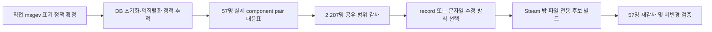

# 전체 여성 무장 이름 불일치 수정 계획

## 목표

정적 감사에서 발견한 여성 무장 이름 불일치를, 다른 무장에 부작용을 내지 않는 범위에서
수정 가능한 단위로 확정한다. 이 문서는 작업 계획이며 `msgdata`, `msgev`, 실행 파일,
Steam 설치본을 변경하지 않는다.

## 현재 입력

- 정적 여성 무장 범위: 57명
- component 정적 대조: 정확 일치 29명, 불일치 14명, 복수 후보 5명, 공백 차이 4명,
  SC 두-part 분해 불가 5명
- 이미 승인된 파일 전용 `msgdata` 후보: 11행
- 아직 확보하지 못한 근거: `무장 ID → 실제 런타임 레코드의 +0x08/+0x0A/+0x0C/+0x0E
  component ID` 대응표

## 수정 원칙

1. **정적 source 분해만으로 component를 고치지 않는다.** 한자 일반어 component가 고유명
   독음 후보로 잡히는 사례가 많다.
2. 실제 무장 레코드가 직접 `msgev` 표기와 다른 결과를 낼 때만 수정 후보를 만든다.
3. 공유 component의 문자열을 바꾸기 전에는 역사 무장 2,207명 전체와 편집기 영향 범위를
   조사한다.
4. 이름 하나만 잘못된 경우에는 공용 문자열 치환보다 **그 무장의 record component pair 수정**을
   우선 검토한다.
5. 모든 후보는 Steam 밖의 별도 출력 디렉터리에만 생성한다. 적용은 명시 승인된 릴리스 직전에만
   허용한다.

## 작업 흐름

## 단계 1 — 직접 표기 정책 확정

아래 4개는 component 조합 문제가 아니라, 직접 `msgev` 한국어 표기의 관용형/엄격 전사
선택 문제다. 먼저 프로젝트 표준을 결정하고, 결정이 난 경우에만 **직접 `msgev` 전용**
수정 후보를 만든다.

| ID | 현행 | 엄격 전사 참고형 | 결정할 내용 |
|---:|---|---|---|
| 486 | 오호리 츠루 | 오호리 쓰루 | `츠` 유지 또는 `쓰` 통일 |
| 567 | 오츠야노카타 | 오쓰야노가타 | 관용형 유지 또는 엄격 전사 채택 |
| 1827 | 마츠 | 마쓰 | `마츠/마쓰` 프로젝트 표준 |
| 2005 | 무라마츠도노 | 무라마쓰도노 | 1827 결정과 동일하게 통일 |

권장 기본안은 **기존 관용형은 유지**하고, 사용자가 `마쓰` 통일을 명시할 때만 1827·2005를
함께 수정하는 것이다. `마쓰히메`는 이미 `마쓰`이므로, 통일을 택하면 세 항목을 묶어 검증한다.

## 단계 2 — 실제 component pair 정적 복원

대상은 정적 조합이 직접 이름과 불일치한 아래 14명이다.

| ID | 직접 표기 | 정적 후보가 틀릴 수 있는 이유 |
|---:|---|---|
| 231 | 이즈모노 오쿠니 | 연결 성분 누락 |
| 407 | 오메 | 접두어/장음 |
| 486 | 오호리 츠루 | `츠/쓰` |
| 567 | 오츠야노카타 | `츠/쓰`, `카/가` |
| 745 | 기쓰노 | 한자 음독과 고유명 독음 |
| 843 | 고마쓰 | 고유명 독음 |
| 1088 | 주케이니 | 법명 접미사 |
| 1120 | 스이신 | 한자 뜻 component |
| 1416 | 도타고젠 | 성씨 독음 |
| 1571 | 뇨슌니 | 법명 독음 |
| 1970 | 묘렌후진 | 일본어 호칭 |
| 2005 | 무라마츠도노 | 호칭 독음 |
| 2029 | 모치즈키 치요메 | `치/지` |
| 2106 | 야마노테도노 | 고유명·호칭 |

정적 추적 순서:

1. Ghidra에서 `FUN_1405DBD30`의 DB 포인터 테이블 초기화·역직렬화 루틴을 찾는다.
2. 각 무장 ID가 가리키는 런타임 상당 레코드를 복원한다.
3. `FUN_1405F40D0`가 읽는 `+0x0C/+0x0E`, fallback `+0x08/+0x0A` 값을 57명 전부에
   덤프한다.
4. 각 pair를 한국어 `msgdata`에 대입해 직접 `msgev` 표기와 비교한다.
5. 대응표에는 ID, 두 component ID, 분기 선택 근거, 입력 파일 해시만 기록한다. 원문
   문자열은 포함하지 않는다.

산출물: `female_officer_runtime_component_map.v1.json` (Steam 밖, source-free).

## 단계 3 — 수정 방식 결정

실제 pair가 확보된 뒤 다음 기준으로 하나만 선택한다.

| 판정 | 수정 방식 |
|---|---|
| 실제 pair 결과가 직접 `msgev`와 일치 | 수정 없음 |
| 실제 pair가 잘못된 공용 일반어 component를 참조 | record pair 교체 우선 |
| 실제 pair가 맞고 component 문자열 자체가 잘못됨 | 공유 범위 통과 시 제한된 `msgdata` 치환 |
| 직접 `msgev`만 표기 정책과 다름 | 단계 1 결정 후 해당 `msgev` 행만 수정 |

`물신`, `주군`, `아마` 같은 일반어 component는 단독으로 바꾸지 않는다. 이들은 다른 UI와
다른 무장에서 정상 단어일 수 있다.

## 단계 4 — 공유 범위·후보 빌드 검증

각 변경 후보마다 아래를 필수로 기록한다.

- 영향 component 또는 record ID와 원본 UTF-16LE 해시
- 역사 무장 2,207명에 대한 정적 연결 범위
- 57명 전수의 조합 결과와 직접 `msgev` 결과
- 변경하지 않은 모든 `msgdata`/`msgev` 행의 불변성
- 후보 파일의 LZ4 왕복·해시 검증
- Steam `MSG_PK/JP/msgdata.bin` 및 `msgev.bin` 해시가 변하지 않았다는 확인

## 보류 항목

복수 후보 5명(172, 789, 1827, 1861, 2088), 분해 불가 5명(403, 404, 405, 406, 1729),
공백 차이 4명(1157, 1170, 1171, 1582)도 위의 runtime component map이 생기면 함께
재판정한다. 그전에는 현행을 유지한다.

## 실행 결과 — 2026-07-26

### 확정 정책

- 직접 `msgev` 표기 네 건(486, 567, 1827, 2005)은 기존 관용 표기를 유지했다.
  따라서 `msgev.bin`은 후보에도 포함하지 않았다.
- 14건의 source-compatible 정적 불일치에는 새로운 `msgdata` 치환을 만들지 않았다.
  이는 각 무장의 실제 record component pair가 없는 상태에서 일반어 component를
  전역 변경하지 않는다는 수정 원칙 1·3을 적용한 결과다.

### component record 정적 복원 결과

Ghidra에서 조합기 `FUN_1405F40D0`와 조회기 `FUN_1405DBD30`를 다시 추적했다.
조회기의 DB 루트는 `DAT_14213CB08`이며, 정적 실행 이미지에서는 0으로 초기화된
런타임 포인터다. 확인 가능한 참조는 읽기뿐이어서 정적 EXE만으로는 57명의
`+0x08/+0x0A/+0x0C/+0x0E` record pair를 덤프할 수 없었다.

보조적으로 `62, 2083`(오이치로 이미 확인된 component pair)의 두 16-bit raw byte
순서를 아래 정적 입력에서 검색했다. 553개 파일 전체에서 발견되지 않았다.

- `SCENARIO`, `SCENARIO_PK`, `PARAM`, `PARAM_PK`
- `F:\Games\NOBU16\SteamData`의 `HDATA`/`EDATA`와 저장 데이터
- `DLC_PK/Common/bma_00.n16`, `DLC_PK/Common/bms_00.n16`

이 결과는 레코드가 없다는 주장이 아니라, 해당 정적 입력이 실제 runtime DB의
직렬화 원본이 아니거나 압축/간접 로딩 경로라는 경계 증거다. 그러므로
`female_officer_runtime_component_map.v1.json`은 추측으로 만들지 않았다.

### 생성·검증한 안전 후보

이미 범위가 확인된 11개 `msgdata` 행(287, 376, 386, 434, 773, 791, 2081, 2082,
2083, 2087, 6708)은 Steam 밖 후보로 다시 빌드했다.

- 입력 `MSG_PK/JP/msgdata.bin` SHA-256:
  `6E2B883004545B2DD7D28360AFEED7D3BFDFEF2BF45E8333FD95CD0A49E95C70`
- 후보 SHA-256:
  `9152049115BB32EFCF7E36BD8553CEA200C2417D1E5FA1BFCE8B6F22E700D038`
- 11개 행 외 텍스트 보존, LZ4 parse/rebuild, 후보 round-trip, wrapper prefix,
  입력 불변성을 모두 통과했다.
- 57명 재감사 PASS: 정확 29, 정적 불일치 14, 공백만 차이 4, 복수 후보 5,
  source pair 미확정 5. 이 수치는 runtime pair 판정이 아니라 보류 항목을
  재확인하는 정적 대조 결과다.

Steam의 `msgdata.bin`과 `msgev.bin`은 수정하지 않았다. 재검증 시 SHA-256은 각각
`6E2B883004545B2DD7D28360AFEED7D3BFDFEF2BF45E8333FD95CD0A49E95C70`,
`D8BFACEB7422BEB3460EFC6B9509882759E6D5374A8B0AC41E920514FACC5BA4`였다.
